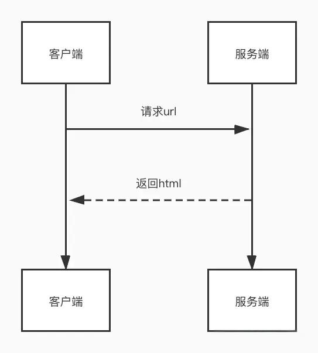
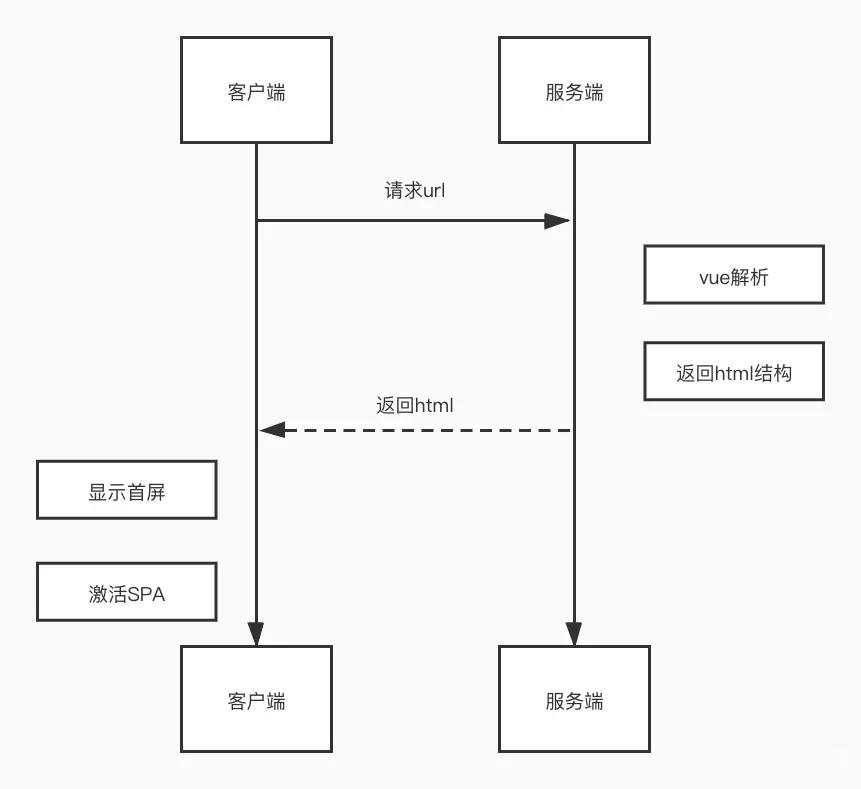
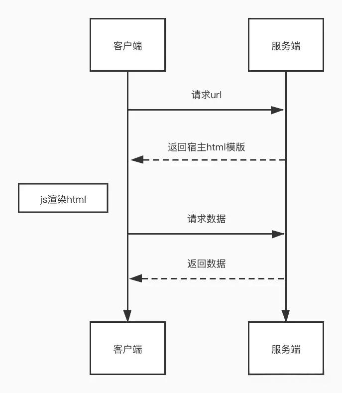
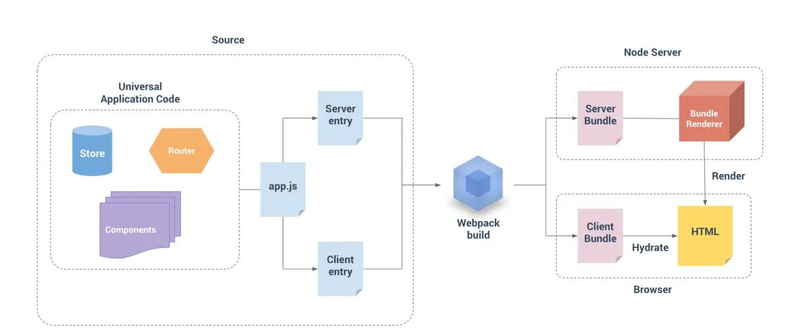

# Vue 使用

[Vue](https://cn.vuejs.org/) 是国内最普及的前端框架，面试考察概率最高。

::: tip
如有疑问，可免费 [加群](/docs/services/group.md) 讨论咨询，也可参与 [1v1 面试咨询服务](/docs/services/1v1.md)， 专业、系统、高效、全流程 准备前端面试
:::

## 🔥Vue3 和 Vue2 的区别有哪些？说几个主要的

Vue 3 提供了更现代化、更高性能的架构，通过 `Composition API` 和 `Proxy` 响应式系统等改进提升了开发体验 :tada::tada::tada:。相比于 Vue 2，它的优势如下:

::: details 参考答案

**性能优化**

- **虚拟 DOM 重构**：Vue3的虚拟DOM采用了更高效的 `Diff算法`，减少了渲染和更新的开销。

- **Tree-shaking 支持**：Vue3的代码结构模块化，支持按需引入，减小了打包体积。

**Composition API**

- Vue3引入了Composition API，使代码更模块化、复用性更强。

- 使用 `setup()` 方法代替了部分选项式 API，通过函数的方式组织逻辑，代码更加清晰简洁。

**响应式系统改进**

- Vue3使用 `Proxy` 实现响应式，解决了 Vue2使用Object.defineProperty实现响应式的一些局限性，如无法监听新增属性和数组索引变化。

**新特性和改进**

- **Teleport**：可以将组件的DOM渲染到指定的DOM节点之外，例如模态框、通知等。

- **Fragment 支持**：Vue3支持组件返回多个根节点，不再需要单一根节点。

- Vue3原生支持 `TypeScript`，提供更完善的类型推导和开发体验。

- Vue3支持为一个组件绑定多个 `v-model`，并且可以自定义 `prop` 和 `event` 名称。

:::

## 🔥Vue 组件的通讯方式有哪些？

组件之间的通讯通常分为父子组件通讯和跨组件通讯。要注意，vue3 组件的通讯方式和 vue2 有一定的区别。

::: details 参考答案

**父子组件通信**

- Props：父组件通过 `props` 向子组件传递数据。
- $emit：子组件通过 `$emit` 向父组件发送事件，并可以传递数据。
- 获取组件实例对象，调用属性或方法：
  💡 Vue 2：通过 `this.$parent` 获取父组件实例，或通过 `this.$children` 获取子组件实例。
  💡 Vue 3：通过 `ref` 引用子组件，直接访问其属性和方法。
- Vue 3 组件支持多个 `v-model` 绑定和自定义属性名，父子之间的双向绑定更加灵活。

**跨组件通信**

- Provide / Inject：父组件通过 `provide` 向后代组件传递数据，后代组件使用 `inject` 接收数据，适用于深层嵌套组件间的通信。
- vuex：通过全局状态管理库 Vuex 共享状态，实现跨组件通信（vue2）。
- pinia：Pinia 是 Vue 3 推荐的全局状态管理库，替代了 Vuex。
- 事件总线（Vue 2）：Vue 2 中可以通过`Event Bus`实现组件间的通信，但在 Vue 3 中不推荐使用。
- 全局事件处理器：通过在根组件$root或全局对象上监听事件，进行跨组件通信（Vue 3 推荐使用外部库，如 `mitt`）。
  :::

## 🔥Vue 组件的生命周期

Vue 组件的生命周期是指组件从创建到销毁的整个过程，包括组件的初始化、渲染、更新和销毁等阶段。在Vue2和Vue3中，组件的生命周期有一些区别。

::: details Vue2

- **创建阶段**

1️⃣ **beforeCreate**：组件实例刚被创建，数据观测和事件/监听器设置之前。此时无法访问 `data` 、 `computed` 和 `methods` 等。
2️⃣ **created**：组件实例已创建，数据观测、事件/监听器设置完成，此时可以访问 `data` 、 `computed` 和 `methods` 等，通常用于数据初始化。

- **挂载阶段**

3️⃣ **beforeMount**：在挂载开始之前，模板已编译， `el` 和 `template` 已经确定，但尚未渲染。
4️⃣ **mounted**：组件实例挂载到 DOM 上之后，此时可以访问和操作 DOM。

- **更新阶段**

5️⃣ **beforeUpdate**：数据发生变化，DOM 尚未更新。可以在这里做一些数据处理，避免不必要的渲染。
6️⃣ **updated**：数据变化，DOM 更新后调用。此时组件的 DOM 已经更新，可以访问和操作新的 DOM。

- **销毁阶段**

7️⃣ **beforeDestroy**：组件实例销毁之前。可以在此阶段进行清理工作，例如移除事件监听器、定时器等。
8️⃣ **destroyed**：组件实例销毁之后。此时，所有的事件监听器和子组件已被销毁。

:::

::: details Vue3

- **创建阶段**

1️⃣ **onBeforeMount**：等效于 Vue 2 中的 `beforeMount` ，在组件挂载之前调用。
2️⃣ **onMounted**：等效于 Vue 2 中的 `mounted` ，在组件挂载之后调用。

- **更新阶段**

3️⃣ **onBeforeUpdate**：等效于 Vue 2 中的 `beforeUpdate` ，在数据更新之前调用。
4️⃣ **onUpdated**：等效于 Vue 2 中的 `updated` ，在数据更新并渲染之后调用。

- **销毁阶段**

5️⃣ **onBeforeUnmount**：等效于 Vue 2 中的 `beforeDestroy` ，在组件卸载前调用。
6️⃣ **onUnmounted**：等效于 Vue 2 中的 `destroyed` ，在组件卸载后调用。

:::

::: tip setup与生命周期

setup 作为 Vue3 的 Composition API 的一部分, 其内部函数的执行时机早于Mounted钩子。

```vue{7}
<script setup>
  import { ref, onMounted } from 'vue';
  console.log("setup");
  onMounted(() => {
  console.log('onMounted');
  });
  // 执行结果:setup onMounted
</script>

```

:::

## Vue 组件在哪个生命周期发送 ajax 请求？

在 Vue中，接口请求一般放在 `created` 或 `mounted` 生命周期钩子中。

::: details 参考答案

**created 钩子**

- 优点：
  ✅ **更快获取数据**：能尽早获取服务端数据，减少页面加载时间。
  ✅ **SSR 支持**：支持服务器端渲染（SSR），在 SSR 环境中不会受到限制。

- 缺点
  ❌ UI 未渲染时发起请求：如果需要操作 DOM 或渲染数据，可能导致闪屏问题

**mounted 钩子**

- 优点：
  ✅ **DOM 可用**：适合需要操作 DOM 或渲染数据后再发起请求的情况，避免闪屏。

- 缺点
  ❌ **请求延迟**：数据请求会稍微延迟，增加页面加载时间。
  ❌ **SSR 不支持**：`mounted` 只在客户端执行，不适用于 SSR 环境。

:::

## Vue 父子组件生命周期调用顺序

::: details 参考答案

1️⃣ 创建阶段

- 父组件：`beforeCreate` ➡️ `created`
- 子组件：`beforeCreate` ➡️ `created`
- 顺序：
  父组件的 `beforeCreate` 和 `created` 先执行 ，子组件的 `beforeCreate` 和 `created` 后执行。
  > 原因：父组件需要先完成自身的初始化（如 data、computed 等），才能解析模板中的子组件并触发子组件的初始化。

2️⃣ 挂载阶段

- 父组件：`beforeMount`
- 子组件：`beforeMount` ➡️ `mounted`
- 父组件：`mounted`
- 顺序：
  父 `beforeMount` → 子 `beforeCreate`→ 子 `created`→ 子 `beforeMount`→ 子 `mounted` → 父 `mounted`
  > 原因：父组件在挂载前（beforeMount）需要先完成子组件的渲染和挂载，因为子组件是父组件模板的一部分。只有当所有子组件挂载完成后，父组件才会触发自身的 mounted。

3️⃣ 更新阶段

- 父组件：`beforeUpdate`
- 子组件：`beforeUpdate` ➡️ `updated`
- 父组件：`updated`
- 顺序：
  父 `beforeUpdate` → 子 `beforeUpdate` → 子 `updated` → 父 `updated`
  > 原因：父组件的数据变化会触发自身更新流程，但子组件的更新必须在父组件更新前完成（因为子组件可能依赖父组件的数据），最终父组件的视图更新完成。

4️⃣ 销毁阶段

- 父组件：`beforeDestroy`
- 子组件：`beforeDestroy` ➡️ `destroyed`
- 父组件：`destroyed`
- 顺序：
  父 `beforeDestroy` → 子 `beforeDestroy` → 子 `destroyed` → 父 `destroyed`
  > 原因：父组件销毁前需要先销毁所有子组件，确保子组件的资源释放和事件解绑，避免内存泄漏。

::: tip
注：vue3中，`setup()` 替代了 `beforeCreate` 和 `created`，但父子组件的生命周期顺序不变。

:::

## 🔥v-show 和 v-if 的区别

::: details 参考答案

- **渲染方式：**
  💡v-if：条件为 true 时才会渲染元素，条件为 false 时销毁元素。
  💡v-show：始终渲染元素，只是通过 CSS 控制 `display 属性`来显示或隐藏。
- **适用场景：**
  💡v-if：适用于条件变化不频繁的场景。
  💡v-show：适用于条件变化频繁的场景。

:::

## 为何v-if和v-for不能一起使用？

`v-if` 和 `v-for` 不能直接一起使用的原因，主要是因为它们在 **解析优先级** 和 **逻辑处理** 上存在冲突。

::: details 参考答案

由于`v-for` 的解析优先级高于 `v-if`，同时使用 v-if 和 v-for，Vue 首先会循环创建所有dom元素，然后根据条件来判断是否渲染每个元素，这种方式可能导致 Vue 进行大量的 DOM 操作，性能较差。其次，`v-for` 会为每个循环项创建一个新的作用域，而 `v-if` 的条件如果依赖于这个作用域内的数据，可能导致判断逻辑异常。

为避免上述问题，vue官方推荐我们将 `v-if` 放到 `v-for` 外层，或者将 `v-if` 放置到 `v-for` 内部的单个节点上。

```js
<div v-if="show">
  <div v-for="item in list" :key="item.id">{{ item.name }}</div>
</div>
```

:::

## computed 和 watch 有什么区别

::: details 参考答案

**computed**用于计算基于响应式数据的值，并缓存结果:

```vue
<template>
  <div>
    <p>原始值：{{ count }}</p>
    <p>计算后的数值：{{ doubledCount }}</p>
  </div>
</template>

<script setup>
import { ref, computed } from 'vue'

const count = ref(2)

// 计算属性
const doubledCount = computed(() => count.value * 2)
</script>
```

**watch**用于监听数据变化并执行副作用操作

```vue
<template>
  <div>
    <p>原始数值：{{ count }}</p>
    <button @click="count++">增加数值</button>
  </div>
</template>

<script setup>
import { ref, watch } from 'vue'

const count = ref(0)

// 监听器
watch(count, (newVal, oldVal) => {
  console.log(`数值从 ${oldVal} 变为 ${newVal}`)
})
</script>
```

| 特性         | `computed`                                                   | `watch`                                                  |
| ------------ | ------------------------------------------------------------ | -------------------------------------------------------- |
| **用途**     | 用于计算基于响应式数据的值，并缓存结果                       | 用于监听数据变化并执行副作用操作                         |
| **返回值**   | 返回计算结果                                                 | 不返回值，执行副作用                                     |
| **缓存机制** | 只有在访问时才会计算，会缓存计算结果，仅当依赖变化时重新计算 | 数据变化时立即执行回调，不缓存，每次数据变化都会触发回调 |
| **适用场景** | 计算派生数据，避免不必要的重复计算                           | 执行异步操作、处理副作用操作，如 API 请求                |
| **性能**     | 性能较好，避免重复计算                                       | 每次数据变化时都会执行回调函数                           |

:::

## 🔥watch 和 watchEffect 的区别

`watch` 和 `watchEffect` 都是 Vue 3 中用于响应式数据变化时执行副作用的 API，它们的使用场景和工作机制存在区别：

::: details 参考答案

- **依赖追踪方式**

`watch` ：需要显式声明依赖，监听指定的数据源；可以监听多个数据源或进行深度监听。

```js
import { watch, reactive } from 'vue'
const state = reactive({
  count: 0,
})
watch(
  () => state.count, // 显式声明监听的依赖
  (newCount, oldCount) => {
    console.log(`新值 ${newCount} 老值 ${oldCount}`)
  }
)
```

`watchEffect` ：会自动追踪 **作用域内所有的响应式依赖**，不需要显式声明依赖。

```js
import { watchEffect, reactive } from 'vue'
const state = reactive({
  count: 0,
})
watchEffect(() => {
  console.log(`Count 变化了: ${state.count}`) // 自动追踪 `state.count`
})
```

- **执行时机**

`watch` ：在监听的响应式数据变化后立即执行。

`watchEffect` ：在 **组件挂载时** 执行一次副作用，并在 **依赖发生变化时** 再次执行。

- **适用场景**

`watch` ：适用于 **监听特定数据** 变化并执行副作用的场景，如 API 请求、保存操作等。适合需要 **访问新值和旧值** 进行比较的场景。

`watchEffect` ：不需要访问旧值，适用于 **自动追踪多个响应式依赖** 的副作用，如渲染、自动保存等。

:::

> Vue官方API： [watchEffect](https://cn.vuejs.org/api/reactivity-core.html#watcheffect)

## 🔥Vue3 ref 和 reactive 如何选择？

`ref` 和 `reactive` 都是 Vue 3 中用来创建响应式数据的 API，他们的区别及使用场景如下。

::: details 参考答案

- **reactive的实现：**
  `reactive` 通过 `Proxy` 对对象或数组的每个属性进行深度代理，实现响应式。这种设计使得 `reactive` 能自动追踪所有嵌套属性的变化，但由于 `Proxy` 无法直接处理基本数据类型（如 `number` 、 `string` 、 `boolean` ），因此， `reactive` 不适用于基本数据类型。

- **ref的实现：**
  为了实现基本数据类型的响应式，Vue 设计了 `ref` 。 `ref` 会将基本数据类型封装为一个包含 `value` 属性的对象，通过 `getter` 和 `setter` 实现响应式依赖追踪和更新。当访问或修改 `ref.value` 时，Vue 内部会触发依赖更新。此外，对于复杂数据类型（如对象或数组）， `ref` 的内部实现会直接调用 `reactive` ，将复杂数据类型变为响应式。

::: tip 如何选择

**Vue官方建议**使用 `ref()` 作为声明响应式状态的主要，因为 `reactive` 存在以下局限性：

💡有限的值类型：它只能用于对象类型 (对象、数组和如 Map、Set 这样的集合类型)。它不能持有如 string、number 或 boolean 这样的原始类型。
💡不能替换整个对象：由于 Vue 的响应式跟踪是通过属性访问实现的，因此我们必须始终保持对响应式对象的相同引用。这意味着我们不能轻易地“替换”响应式对象，因为这样的话与第一个引用的响应性连接将丢失：

```js
let state = reactive({
  count: 0,
})

// 上面的 ({ count: 0 }) 引用将不再被追踪
// (响应性连接已丢失！)
state = reactive({
  count: 1,
})
```

💡对解构操作不友好：当我们将响应式对象的原始类型属性解构为本地变量时，或者将该属性传递给函数时，我们将丢失响应性连接

```js
const state = reactive({
  count: 0,
})
// 当解构时，count 已经与 state.count 断开连接
let { count } = state
// 不会影响原始的 state
count++

// 该函数接收到的是一个普通的数字
// 并且无法追踪 state.count 的变化
// 我们必须传入整个对象以保持响应性
callSomeFunction(state.count)
```

:::

## 什么是动态组件？如何使用它？

::: details 参考答案

动态组件是 Vue 提供的一种机制，允许我们根据条件动态切换渲染的组件，而不需要手动修改模板。
在Vue中，我们可以通过 ` <component>` 标签的 `:is` 属性指定需要渲染的组件：

```vue
<template>
  <div>
    <!-- 动态渲染组件 -->
    <component :is="currentComponent"></component>

    <!-- 控制组件切换 -->
    <button @click="currentComponent = 'ComponentA'">显示组件A</button>
    <button @click="currentComponent = 'ComponentB'">显示组件B</button>
  </div>
</template>

<script setup>
import { ref } from 'vue'
import ComponentA from './ComponentA.vue'
import ComponentB from './ComponentB.vue'

// 当前显示的组件
const currentComponent = ref('ComponentA')
</script>
```

`<component>` 标签的 `:is` 属性值可以是：

- 被注册的组件名
- 导入的组件对象
- 一般的 HTML 元素

当使用 `<component :is="...">` 来在多个组件间作切换时，被切换掉的组件会被卸载。如果需要保留动态组件状态，使用 `<KeepAlive>` 组件即可。

:::

## 什么是 slot ，有什么应用场景？

slot 是 Vue 中的一种用于 组件内容分发 的机制。它允许父组件向子组件插入内容，从而使组件更加灵活和可复用。

::: details 参考答案

在Vue中，插槽的使用方式可以分为四种：**默认插槽**、**具名插槽**、**条件插槽**和**作用域插槽**。

- **默认插槽**

默认插槽是最简单的插槽形式，它允许我们将组件的内容传递到组件内部的一个占位符中。

子组件 `MyComponent.vue`

```vue
<template>
  <div>
    <p>我是子组件的标题</p>
    <slot></slot>
  </div>
</template>
```

父组件

```vue
<template>
  <MyComponent>
    <p>这是插槽内容，由父组件传入</p>
  </MyComponent>
</template>
```

输出结果：

```html
<div>
  <p>我是子组件的标题</p>
  <p>这是插槽内容，由父组件传入</p>
</div>
```

- **具名插槽**

当子组件需要多个插槽时，可以为插槽命名，并由父组件指定内容放置到哪个插槽。

子组件 `MyComponent.vue`

```vue
<template>
  <slot name="header">默认标题</slot>
  <slot>默认内容</slot>
  <slot name="footer">默认页脚</slot>
</template>
```

父组件

```vue
<template>
  <MyComponent>
    <template v-slot:header>
      <h1>我来组成头部</h1>
    </template>
    <!-- 隐式的默认插槽 -->
    <p>我来组成身体</p>
    <template v-slot:footer>
      <p>我来组成尾部</p>
    </template>
  </MyComponent>
</template>
```

输出结果：

```html
<div>
  <h1>我来组成头部</h1>
  <p>我来组成身体</p>
  <p>我来组成尾部</p>
</div>
```

> `v-slot` 有对应的简写 `#` ，因此 `<template v-slot:header>` 可以简写为 `<template #header>` 。其意思就是“将这部分模板片段传入子组件的 header 插槽中”。

- **条件插槽**

我们可以根据插槽是否存在来渲染某些内容:

子组件 `MyComponent.vue`

```vue
<template>
  <div class="card">
    <div v-if="$slots.header" class="card-header">
      <slot name="header" />
    </div>

    <div v-if="$slots.default" class="card-content">
      <slot />
    </div>

    <div v-if="$slots.footer" class="card-footer">
      <slot name="footer" />
    </div>
  </div>
</template>
```

- **作用域插槽**

作用域插槽可以让子组件在渲染时将一部分数据提供给插槽，从而实现父组件的插槽访问到子组件的状态。

子组件 `MyComponent.vue`

```vue
<template>
  <ul>
    <!-- 定义作用域插槽，并将 items 数据传递给父组件 -->
    <slot :items="items"></slot>
  </ul>
</template>

<script setup>
import { ref } from 'vue'

// 定义数据 items
const items = ref(['华为', '小米', '苹果'])
</script>
```

```vue
<template>
  <MyComponent>
    <!-- 使用作用域插槽，接收子组件传递的 items 数据 -->
    <template #default="{ items }">
      <li v-for="(item, index) in items" :key="index">
        {{ item }}
      </li>
    </template>
  </MyComponent>
</template>

<script setup>
import MyComponent from './MyComponent.vue'
</script>
```

输出结果：

```html
<ul>
  <li>华为</li>
  <li>小米</li>
  <li>苹果</li>
</ul>
```

> Vue官方API： [插槽 Slots](https://cn.vuejs.org/guide/components/slots.html#scoped-slots)

::: tip 应用场景

💡灵活的组件内容插入：
插槽允许我我们将内容插入组件中，而无需修改子组件内部逻辑，极大提高了组件的灵活性。

💡构建通用组件：
比如开发卡片、模态框、列表等组件，使用插槽可以轻松实现内容的自定义。模态框组件可通过插槽自定义标题、正文和按钮。

💡减少重复代码：
通过插槽，将公共逻辑封装到子组件中，而在父组件中只需插入变化的内容。

:::

## 🚀Vue 项目可做哪些性能优化？

🔍在 Vue 项目中，我们可以利用 Vue 特有的功能和机制实现性能优化。

::: details 参考答案

1️⃣ **模板和指令优化**

- 合理的使用 `v-if` 和 `v-show` 指令，避免不必要的渲染。
- 使用 `v-for` 时，尽量提供唯一的 `key` ，避免重复渲染。
- 使用 `v-once` 指令，只渲染一次，避免不必要的计算。
- 使用 `v-memo` 指令，对使用`v-for`生成的列表进行渲染优化。`(vue3.2新增)`

2️⃣ **组件优化**

- 合理使用 `keep-alive` 组件，缓存组件实例，避免重复渲染。
- 使用异步组件加载，减少首屏加载时间。

```js
const AsyncComponent = defineAsyncComponent(() => import('./MyComponent.vue'))
```

- 配合 Vue Router 使用路由懒加载，实现路由页面按需加载。
- 合理划分组件，提升复用性和渲染性能。

3️⃣ **响应式优化**

- 使用 `Object.freeze` 冻结对象，避免不必要的响应式。
- 使用 stop 停止 不必要的watchEffect副作用执行，以减少性能消耗。
- watch的优化

  💡 避免滥用深度监听，降低性能开销。

  💡 对于频繁触发的响应式数据变化，可以通过防抖和节流优化监听逻辑。

```js
import { debounce } from 'lodash'

watch(
  () => searchQuery,
  debounce((newQuery) => {
    fetchSearchResults(newQuery)
  }, 300)
)
```

💡 可以通过返回函数只监听具体的依赖，减少不必要的触发。

```js
watch([() => user.name, () => user.age], ([newName, newAge]) => {
  //...
})
```

💡 当监听器在某些条件下不再需要时，可以通过返回的 stop 方法手动停止监听，以节省资源

```js
const stop = watch(
  () => data.value,
  (newValue) => {
    if (newValue === 'done') {
      stop() // 停止监听
    }
  }
)
```

💡 当多个监听器的回调逻辑类似时，可以合并监听

```js
watch([() => user.name, () => user.age], ([newName, newAge]) => {
  //...
})
```

:::

## 什么是 nextTick 如何应用它

::: details 参考答案

在 Vue.js 中， `nextTick` 是一个核心工具方法，用于处理 DOM 更新时机问题。它的核心作用是：**在下次 DOM 更新循环结束后执行回调，确保我们能操作到最新的 DOM 状态。**
它的使用场景如下：

- 数据变化后操作 DOM

```vue
<script setup>
async function increment() {
  count.value++
  // DOM 还未更新
  console.log(document.getElementById('counter').textContent) // 0
  await nextTick()
  // DOM 此时已经更新
  console.log(document.getElementById('counter').textContent) // 1
}
</script>

<template>
  <button id="counter" @click="increment">{{ count }}</button>
</template>
```

- 在生命周期钩子中操作 DOM

```vue
<script setup>
import { ref, onMounted, nextTick } from 'vue'
// 创建 DOM 引用
const element = ref(null)

onMounted(() => {
  // 直接访问可能未渲染完成
  console.log(element.value.offsetHeight) // 0 或未定义
  // 使用 nextTick 确保 DOM 已渲染
  nextTick(() => {
    console.log(element.value.offsetHeight) // 实际高度
  })
})
</script>
```

注意，在vue2中和vue3的选项式 API中，我们使用this.$nextTick(callback)的方式调用。

```js
this.$nextTick(() => {
  console.log(this.$refs.text.innerText) // "更新后的文本"
})
```

:::

## 使用 Vue3 Composable 组合式函数，实现 useCount

::: tip

在 Vue 应用的概念中，“**组合式函数**”(Composables) 是一个利用 Vue 的组合式 API 来封装和复用有状态逻辑的函数。它和自定义 `React hooks` 非常相似。

:::

使用组合式函数实现如下需求：useCount 是一个计数逻辑管理的组合式函数，它返回一个 `count` 变量和增加、减少、重置count的方法。

::: details 参考答案

```vue
<script setup>
import { ref } from 'vue'

// 实现 useCount 组合式函数
function useCount() {
  const count = ref(0)
  const increment = () => {
    count.value++
  }
  const decrement = () => {
    count.value--
  }
  const reset = () => {
    count.value = 0
  }
  return {
    count,
    increment,
    decrement,
    reset,
  }
}

// 使用 useCount 组合式函数
const { count, increment, decrement, reset } = useCount()
</script>

<template>
  <div>
    <h2>计数器: {{ count }}</h2>
    <button @click="increment">增加</button>
    <button @click="decrement">减少</button>
    <button @click="reset">重置</button>
  </div>
</template>
```

:::

## 使用 Vue3 Composable 组合式函数，实现 useRequest

```js
const { loading, data, error } = useRequest(url) // 可只考虑 get 请求
```

::: details 参考答案

```ts
import { ref, computed } from 'vue';
import axios from 'axios';

// 实现 useRequest 组合式函数
function useRequest(url) {
  const loading = ref(false); // 请求状态
  const data = ref(null); // 响应数据
  const error = ref(null); // 错误信息

  const fetchData = async () => {
    loading.value = true;
    error.value = null;
    try {
      const response = await axios.get(url); /
      data.value = response.data;
    } catch (err) {
      error.value = err.message || '请求失败'; /
    } finally {
      loading.value = false;
    }
  };

  // 自动触发请求
  fetchData();

  return {
    loading,
    data,
    error,
  };
}

export default useRequest;
```

使用

```vue
<script setup>
import useRequest from './useRequest'
const url = 'https://www.mianshipai.com/'
const { loading, data, error } = useRequest(url)
</script>
<template>
  <div>
    <h2>请求数据</h2>
    <div v-if="loading">加载中...</div>
    <div v-else-if="error">{{ error }}</div>
    <div v-else>
      <p>{{ data }}</p>
    </div>
  </div>
</template>
```

:::

## 自定义组件如何实现 v-model

`v-model` 可以在组件上使用以实现双向绑定。

::: details vue2
在vue2中，自定义组件使用 `v-model` ，需要在组件内部定义 `value` prop，然后通过 `this.$emit('input', newValue)` 触发更新即可。

```vue
<!-- CustomInput.vue -->
<template>
  <input :value="value" @input="$emit('input', $event.target.value)" />
</template>

<script>
export default {
  props: ['value'],
}
</script>
```

使用方式：

```vue
<CustomInput v-model="searchText" />
```

:::

::: details vue3
与vue2类似，vue3自定义组件使用 `v-model` ，需要在组件内部定义 `modelValue` prop，然后通过 `emit('update:modelValue', newValue)` 触发更新

```vue
<!-- CustomInput.vue -->
<template>
  <input :value="modelValue" @input="$emit('update:modelValue', $event.target.value)" />
</template>

<script setup>
defineProps(['modelValue'])
defineEmits(['update:modelValue'])
</script>
```

使用方式：

```vue
<CustomInput v-model="searchText" />
```

---

**👉注意，从 Vue 3.4 开始，官方推荐的实现方式是使用 defineModel() 宏：**

```vue
<!-- Child.vue -->
<script setup>
const model = defineModel()

function update() {
  model.value++
}
</script>

<template>
  <div>父组件的 v-model 值为: {{ model }}</div>
  <button @click="update">Increment</button>
</template>
```

父组件使用 v-model 绑定一个值：

```vue
<!-- Parent.vue -->
<Child v-model="countModel" />
```

`defineModel` 是一个便利宏，其返回的值是一个 `ref` 。它可以像其他 `ref` 一样被访问以及修改，不过它能起到在父组件和当前变量之间的双向绑定的作用：

- 它的 `.value` 和父组件的 `v-model` 的值同步；
- 当它被子组件变更了，会触发父组件绑定的值一起更新。
  根据 `defineModel` 的特性，我们可以用 `v-model` 把这个 `ref` 绑定到一个原生 `input` 元素上：

```vue
<script setup>
const model = defineModel()
</script>

<template>
  <input v-model="model" />
</template>
```

> 此外，v-model 可以接受自定义参数、添加修饰符，组件也可以绑定多个 v-model ，具体用法请参考
> 官网文档：[组件 v-model](https://cn.vuejs.org/guide/components/v-model)

:::

## 如何统一监听 Vue 组件报错

::: details 参考答案

在 Vue 3 中，可以通过 全局错误处理器 `（errorHandler）` 和 生命周期钩子（例如 `onErrorCaptured` ）来统一监听和处理组件中的错误。

- **通过全局错误处理器 `app.config.errorHandler`**

```TypeScript
import { createApp } from 'vue';
const app = createApp(App);
// 设置全局错误处理器
app.config.errorHandler = (err, instance, info) => {
  console.error('捕获到组件错误: ', err);
  console.log('发生错误的组件实例: ', instance);
  console.log('错误信息: ', info);
};

app.mount('#app');
```

- **局部错误捕获（onErrorCaptured）**

`onErrorCaptured` 钩子可以捕获后代组件传递过程中的错误信息

```vue
<script setup>
import { onErrorCaptured } from 'vue'

onErrorCaptured((err, instance, info) => {
  console.error('局部捕获到错误: ', err)
  console.log('错误来源组件: ', instance)
  console.log('错误信息: ', info)

  // 这个钩子可以通过返回 false 来阻止错误继续向上传递。
  return false // 如果需要让错误冒泡到全局，省略或返回 true
})
</script>

<template>
  <div>
    <h2>局部错误捕获示例</h2>
    <ErrorProneComponent />
  </div>
</template>
```

> Vue官方API： [onErrorCaptured](https://cn.vuejs.org/api/composition-api-lifecycle.html#onerrorcaptured)、[errorHandler](https://cn.vuejs.org/api/application.html#app-config-errorhandler)

:::

## Vuex 中 mutation 和 action 有什么区别？

在 Vuex 中， `mutation` 和 `action` 是用于管理状态的两种核心概念。

::: details 参考答案
`mutation` 可以直接修改 `store` 中的 **state**值，它只支持同步操作。 `Action` 不能直接修改 **state**，而是通过调用 `mutation` 来间接修改，它用于处理异步操作。

```js
const store = createStore({
  state: {
    count: 0, // 定义状态
  },
  mutations: {
    // Mutation 示例（同步）
    increment(state, payload) {
      state.count += payload
    },
  },
})

// 组件中调用
this.$store.commit('increment', 5)
```

```js
const store = createStore({
  state: {
    count: 0, // 定义状态
  },
  mutations: {
    // Mutation：同步修改状态
    increment(state, payload) {
      state.count += payload
    },
  },
  actions: {
    // Action：异步操作，延迟1秒后调用 mutation
    asyncIncrement({ commit }, payload) {
      setTimeout(() => {
        commit('increment', payload) // 提交 mutation 修改状态
      }, 1000)
    },
  },
})

// 组件中调用
this.$store.dispatch('asyncIncrement', 5)
```

**总结：**
| 特性 | Mutation | Action |
| --- | --- | --- |
| 是否同步 | ✅ 同步 | ⏳ 异步（也可以处理同步） |
| 是否直接修改 state | ✅ 直接修改 | ❌ 通过调用 mutation 修改 |
| 调用方式 | `commit('mutationName')` | `dispatch('actionName')` |
| 适用场景 | 简单的状态修改 | 异步操作（如 API 调用） |
| 调试支持 | 完全支持，易于追踪 | 依赖于 mutation 的日志 |

::: tip ⚠️ 为什么要有这样的区分？

- 数据可预测性：通过强制 `Mutation` 同步修改 **State**，使得状态变更可追踪
- 调试友好性：DevTools 可以准确捕捉每次状态快照
- 代码组织：将同步逻辑与异步逻辑分离，提高代码可维护性

:::

参考文章：[VueX用法快速回顾](https://juejin.cn/post/7249033891809329212)

## Vuex 和 Pinia 有什么区别？

::: details 参考答案

`Pinia` 和 `Vuex` 都是 Vue 的专属状态管理库，允许用户跨组件或页面共享状态。

- **区别**

| 特性                | **Vuex**                                | **Pinia**                                       |
| ------------------- | --------------------------------------- | ----------------------------------------------- |
| **版本支持**        | Vue 2 和 Vue 3                          | 仅支持 Vue 3（基于 `Composition API` ）         |
| **API 风格**        | 基于传统的对象式 API                    | 基于 Composition API，类似于 `setup` <br/> 语法 |
| **模块管理**        | 支持模块化（modules），但语法较复杂     | 模块化简单，**每个 store 就是一个独立模块**     |
| **TypeScript 支持** | `TypeScript` 支持不完善，需手动定义类型 | 开箱即用的 `TypeScript` 支持，类型推导更强大    |
| **性能**            | 更适合大型项目，但冗余代码较多          | 更加轻量，性能更好，支持按需加载                |
| **状态持久化**      | 需要额外插件                            | 插件系统更加灵活，支持状态持久化插件            |

- **代码对比**

📝 **vuex**

```javascript
// store.js
import { createStore } from 'vuex'

const store = createStore({
  state: {
    count: 0,
  },
  mutations: {
    increment(state) {
      state.count++
    },
  },
  actions: {
    asyncIncrement({ commit }) {
      setTimeout(() => {
        commit('increment')
      }, 1000)
    },
  },
  getters: {
    doubleCount: (state) => state.count * 2,
  },
})

export default store
```

vue组件中使用

```vue
<script>
export default {
  // 计算属性
  computed: {
    count() {
      return this.$store.state.count
    },
    doubleCount() {
      return this.$store.getters.doubleCount
    },
  },
  methods: {
    // 同步增加
    increment() {
      this.$store.commit('increment')
    },
    // 异步增加
    asyncIncrement() {
      this.$store.dispatch('asyncIncrement')
    },
  },
}
</script>
```

📝**Pinia**

```typescript
// store.js
import { defineStore } from 'pinia'

export const useCounterStore = defineStore('counter', {
  state: () => ({
    count: 0,
  }),
  actions: {
    increment() {
      this.count++
    },
    async asyncIncrement() {
      setTimeout(() => {
        this.increment()
      }, 1000)
    },
  },
  getters: {
    doubleCount: (state) => state.count * 2,
  },
})
```

组件中使用：

```vue
<script setup>
import { useCounterStore } from './store'
const counter = useCounterStore()
</script>

<template>
  <h1>Count的计算值 {{ counter.count }}</h1>
  <h2>Double的计算值 {{ counter.doubleCount }}</h2>
  <button @click="counter.increment">同步增加</button>
  <button @click="counter.asyncIncrement">异步增加</button>
</template>
```

- **如何选择？**

对于vue3项目，官方推荐使用pinia。因为它**更轻量、TypeScript 支持更好、模块化更简单且拥有更强的 DevTools 支持**。

:::

## Vue-router 导航守卫能用来做什么？

::: details 参考答案

`vue Router` 的**导航守卫**用于在路由跳转过程中对导航行为进行**拦截**和**控制**。这些守卫在路由进入、离开或更新时执行，可以用于多种场景，确保应用的导航逻辑符合预期。以下是常见的用途：

- 认证和授权

用于检查用户的登录状态或权限，防止未授权用户访问受限页面。

```javascript
router.beforeEach((to, from, next) => {
  const isAuthenticated = !!localStorage.getItem('token')
  if (to.meta.requiresAuth && !isAuthenticated) {
    next('/login') // 未登录，跳转到登录页
  } else {
    next() // 已登录，正常导航
  }
})
```

- 数据预加载

在进入路由前预加载必要的数据，确保页面渲染时数据已准备好。

```javascript
router.beforeEach(async (to, from, next) => {
  if (to.name === 'userInfo') {
    await store.dispatch('fetchUserData') // 预加载用户数据
  }
  next()
})
```

- 动态修改页面标题

根据路由信息动态更改浏览器标签页的标题，提升用户体验。

```javascript
router.afterEach((to) => {
  document.title = to.meta.title || '自定义标题'
})
```

- 动画和加载效果

在路由切换时展示加载动画或过渡效果，提升用户体验。

```javascript
router.beforeEach((to, from, next) => {
  store.commit('setLoading', true) // 开始加载动画
  next()
})

router.afterEach(() => {
  store.commit('setLoading', false) // 结束加载动画
})
```

- 日志记录和分析

在路由切换时记录用户行为，用于分析或调试。

```javascript
router.afterEach((to, from) => {
  console.log(`用户从 ${from.fullPath} 跳转到 ${to.fullPath}`)
})
```

- 防止访问不存在的页面

通过守卫检查路由是否存在，避免导航到无效页面。

```javascript
router.beforeEach((to, from, next) => {
  const routeExists = router.getRoutes().some((route) => route.name === to.name)
  if (!routeExists) {
    next('/404') // 跳转到 404 页面
  } else {
    next()
  }
})
```

关联文章：[5min带你快速回顾、学习VueRouter的使用！](https://juejin.cn/post/7359084604663840820)
:::

## SSR是什么？解决了什么问题？有做过SSR吗？你是怎么做的？

::: details 参考答案

#### 一、是什么

`Server-Side Rendering` 我们称其为`SSR`，意为服务端渲染

指由服务侧完成页面的 `HTML` 结构拼接的页面处理技术，发送到浏览器，然后为其绑定状态与事件，成为完全可交互页面的过程

先来看看`Web`3个阶段的发展史：

- 传统服务端渲染SSR
- 单页面应用SPA
- 服务端渲染SSR

1. 传统web开发

网页内容在服务端渲染完成，⼀次性传输到浏览器



打开页面查看源码，浏览器拿到的是全部的`dom`结构

2. 单页应用SPA

单页应用优秀的用户体验，使其逐渐成为主流，页面内容由`JS`渲染出来，这种方式称为客户端渲染



打开页面查看源码，浏览器拿到的仅有宿主元素`#app`，并没有内容3. 服务端渲染SSR

`SSR`解决方案，后端渲染出完整的首屏的`dom`结构返回，前端拿到的内容包括首屏及完整`spa`结构，应用激活后依然按照`spa`方式运行



看完前端发展，我们再看看`Vue`官方对`SSR`的解释：

> Vue.js 是构建客户端应用程序的框架。默认情况下，可以在浏览器中输出 Vue 组件，进行生成 DOM 和操作 DOM。然而，也可以将同一个组件渲染为服务器端的 HTML 字符串，将它们直接发送到浏览器，最后将这些静态标记"激活"为客户端上完全可交互的应用程序
>
> 服务器渲染的 Vue.js 应用程序也可以被认为是"同构"或"通用"，因为应用程序的大部分代码都可以在服务器和客户端上运行

我们从上门解释得到以下结论：

- `Vue SSR`是一个在`SPA`上进行改良的服务端渲染
- 通过`Vue SSR`渲染的页面，需要在客户端激活才能实现交互
- `Vue SSR`将包含两部分：服务端渲染的首屏，包含交互的`SPA`

#### 二、解决了什么

SSR主要解决了以下两种问题：

- seo：搜索引擎优先爬取页面`HTML`结构，使用`ssr`时，服务端已经生成了和业务想关联的`HTML`，有利于`seo`
- 首屏呈现渲染：用户无需等待页面所有`js`加载完成就可以看到页面视图（压力来到了服务器，所以需要权衡哪些用服务端渲染，哪些交给客户端）

但是使用`SSR`同样存在以下的缺点：

- 复杂度：整个项目的复杂度

- 库的支持性，代码兼容

- 性能问题

  - 每个请求都是`n`个实例的创建，不然会污染，消耗会变得很大
  - 缓存 `node serve`、 `ngin`x判断当前用户有没有过期，如果没过期的话就缓存，用刚刚的结果。
  - 降级：监控`cpu`、内存占用过多，就`spa`，返回单个的壳

- 服务器负载变大，相对于前后端分离务器只需要提供静态资源来说，服务器负载更大，所以要慎重使用

所以在我们选择是否使用`SSR`前，我们需要慎重问问自己这些问题：

1.  需要`SEO`的页面是否只是少数几个，这些是否可以使用预渲染（Prerender SPA Plugin）实现
1.  首屏的请求响应逻辑是否复杂，数据返回是否大量且缓慢

#### 三、如何实现

对于同构开发，我们依然使用`webpack`打包，我们要解决两个问题：服务端首屏渲染和客户端激活

这里需要生成一个服务器`bundle`文件用于服务端首屏渲染和一个客户端`bundle`文件用于客户端激活



代码结构 除了两个不同入口之外，其他结构和之前`vue`应用完全相同

```js
src
├── router
├────── index.js # 路由声明
├── store
├────── index.js # 全局状态
├── main.js # ⽤于创建vue实例
├── entry-client.js # 客户端⼊⼝，⽤于静态内容“激活”
└── entry-server.js # 服务端⼊⼝，⽤于⾸屏内容渲染
```

路由配置

```js
import Vue from 'vue'
import Router from 'vue-router'

Vue.use(Router)
//导出⼯⼚函数

export function createRouter() {
  return new Router({
    mode: 'history',
    routes: [
      // 客户端没有编译器，这⾥要写成渲染函数
      { path: '/', component: { render: (h) => h('div', 'index page') } },
      { path: '/detail', component: { render: (h) => h('div', 'detail page') } },
    ],
  })
}
```

主文件main.js

跟之前不同，主文件是负责创建`vue`实例的工厂，每次请求均会有独立的`vue`实例创建

```js
import Vue from 'vue'
import App from './App.vue'
import { createRouter } from './router'
// 导出Vue实例⼯⼚函数，为每次请求创建独⽴实例
// 上下⽂⽤于给vue实例传递参数
export function createApp(context) {
  const router = createRouter()
  const app = new Vue({
    router,
    context,
    render: (h) => h(App),
  })
  return { app, router }
}
```

编写服务端入口`src/entry-server.js`

它的任务是创建`Vue`实例并根据传入`url`指定首屏

```js
import { createApp } from './main'
// 返回⼀个函数，接收请求上下⽂，返回创建的vue实例
export default (context) => {
  // 这⾥返回⼀个Promise，确保路由或组件准备就绪
  return new Promise((resolve, reject) => {
    const { app, router } = createApp(context)
    // 跳转到⾸屏的地址
    router.push(context.url)
    // 路由就绪，返回结果
    router.onReady(() => {
      resolve(app)
    }, reject)
  })
}
```

编写客户端入口`entry-client.js`

客户端入口只需创建`vue`实例并执行挂载，这⼀步称为激活

```js
import { createApp } from './main'
// 创建vue、router实例
const { app, router } = createApp()
// 路由就绪，执⾏挂载
router.onReady(() => {
  app.$mount('#app')
})
```

对`webpack`进行配置

安装依赖

```js
npm install webpack-node-externals lodash.merge -D
```

对`vue.config.js`进行配置

```js
// 两个插件分别负责打包客户端和服务端
const VueSSRServerPlugin = require('vue-server-renderer/server-plugin')
const VueSSRClientPlugin = require('vue-server-renderer/client-plugin')
const nodeExternals = require('webpack-node-externals')
const merge = require('lodash.merge')
// 根据传⼊环境变量决定⼊⼝⽂件和相应配置项
const TARGET_NODE = process.env.WEBPACK_TARGET === 'node'
const target = TARGET_NODE ? 'server' : 'client'
module.exports = {
  css: {
    extract: false,
  },
  outputDir: './dist/' + target,
  configureWebpack: () => ({
    // 将 entry 指向应⽤程序的 server / client ⽂件
    entry: `./src/entry-${target}.js`,
    // 对 bundle renderer 提供 source map ⽀持
    devtool: 'source-map',
    // target设置为node使webpack以Node适⽤的⽅式处理动态导⼊，
    // 并且还会在编译Vue组件时告知`vue-loader`输出⾯向服务器代码。
    target: TARGET_NODE ? 'node' : 'web',
    // 是否模拟node全局变量
    node: TARGET_NODE ? undefined : false,
    output: {
      // 此处使⽤Node⻛格导出模块
      libraryTarget: TARGET_NODE ? 'commonjs2' : undefined,
    },
    // https://webpack.js.org/configuration/externals/#function
    // https://github.com/liady/webpack-node-externals
    // 外置化应⽤程序依赖模块。可以使服务器构建速度更快，并⽣成较⼩的打包⽂件。
    externals: TARGET_NODE
      ? nodeExternals({
          // 不要外置化webpack需要处理的依赖模块。
          // 可以在这⾥添加更多的⽂件类型。例如，未处理 *.vue 原始⽂件，
          // 还应该将修改`global`（例如polyfill）的依赖模块列⼊⽩名单
          whitelist: [/.css$/],
        })
      : undefined,
    optimization: {
      splitChunks: undefined,
    },
    // 这是将服务器的整个输出构建为单个 JSON ⽂件的插件。
    // 服务端默认⽂件名为 `vue-ssr-server-bundle.json`
    // 客户端默认⽂件名为 `vue-ssr-client-manifest.json`。
    plugins: [TARGET_NODE ? new VueSSRServerPlugin() : new VueSSRClientPlugin()],
  }),
  chainWebpack: (config) => {
    // cli4项⽬添加
    if (TARGET_NODE) {
      config.optimization.delete('splitChunks')
    }

    config.module
      .rule('vue')
      .use('vue-loader')
      .tap((options) => {
        merge(options, {
          optimizeSSR: false,
        })
      })
  },
}
```

对脚本进行配置，安装依赖

```js
npm i cross-env -D
```

定义创建脚本`package.json`

```js
"scripts": {
 "build:client": "vue-cli-service build",
 "build:server": "cross-env WEBPACK_TARGET=node vue-cli-service build",
 "build": "npm run build:server && npm run build:client"
}
```

> 执行打包：npm run build

最后修改宿主文件`/public/index.html`

```html
<!DOCTYPE html>
<html lang="en">
  <head>
    <meta charset="utf-8" />
    <meta http-equiv="X-UA-Compatible" content="IE=edge" />
    <meta name="viewport" content="width=device-width,initial-scale=1.0" />
    <title>Document</title>
  </head>
  <body>
    <!--vue-ssr-outlet-->
  </body>
</html>
```

> 是服务端渲染入口位置，注意不能为了好看而在前后加空格

安装`vuex`

```js
npm install -S vuex
```

创建`vuex`工厂函数

```js
import Vue from 'vue'
import Vuex from 'vuex'
Vue.use(Vuex)
export function createStore() {
  return new Vuex.Store({
    state: {
      count: 108,
    },
    mutations: {
      add(state) {
        state.count += 1
      },
    },
  })
}
```

在`main.js`文件中挂载`store`

```js
import { createStore } from './store'
export function createApp(context) {
  // 创建实例
  const store = createStore()
  const app = new Vue({
    store, // 挂载
    render: (h) => h(App),
  })
  return { app, router, store }
}
```

服务器端渲染的是应用程序的"快照"，如果应用依赖于⼀些异步数据，那么在开始渲染之前，需要先预取和解析好这些数据

在`store`进行一步数据获取

```js
export function createStore() {
  return new Vuex.Store({
    mutations: {
      // 加⼀个初始化
      init(state, count) {
        state.count = count
      },
    },
    actions: {
      // 加⼀个异步请求count的action
      getCount({ commit }) {
        return new Promise((resolve) => {
          setTimeout(() => {
            commit('init', Math.random() * 100)
            resolve()
          }, 1000)
        })
      },
    },
  })
}
```

组件中的数据预取逻辑

```js
export default {
  asyncData({ store, route }) {
    // 约定预取逻辑编写在预取钩⼦asyncData中
    // 触发 action 后，返回 Promise 以便确定请求结果
    return store.dispatch('getCount')
  },
}
```

服务端数据预取，`entry-server.js`

```js
import { createApp } from './app'
export default (context) => {
  return new Promise((resolve, reject) => {
    // 拿出store和router实例
    const { app, router, store } = createApp(context)
    router.push(context.url)
    router.onReady(() => {
      // 获取匹配的路由组件数组
      const matchedComponents = router.getMatchedComponents()

      // 若⽆匹配则抛出异常
      if (!matchedComponents.length) {
        return reject({ code: 404 })
      }

      // 对所有匹配的路由组件调⽤可能存在的`asyncData()`
      Promise.all(
        matchedComponents.map((Component) => {
          if (Component.asyncData) {
            return Component.asyncData({
              store,
              route: router.currentRoute,
            })
          }
        })
      )
        .then(() => {
          // 所有预取钩⼦ resolve 后，
          // store 已经填充⼊渲染应⽤所需状态
          // 将状态附加到上下⽂，且 `template` 选项⽤于 renderer 时，
          // 状态将⾃动序列化为 `window.__INITIAL_STATE__`，并注⼊ HTML
          context.state = store.state

          resolve(app)
        })
        .catch(reject)
    }, reject)
  })
}
```

客户端在挂载到应用程序之前，`store` 就应该获取到状态，`entry-client.js`

```js
// 导出store
const { app, router, store } = createApp()
// 当使⽤ template 时，context.state 将作为 window.__INITIAL_STATE__ 状态⾃动嵌⼊到最终的 HTML
// 在客户端挂载到应⽤程序之前，store 就应该获取到状态：
if (window.__INITIAL_STATE__) {
  store.replaceState(window.__INITIAL_STATE__)
}
```

客户端数据预取处理，`main.js`

```js
Vue.mixin({
  beforeMount() {
    const { asyncData } = this.$options
    if (asyncData) {
      // 将获取数据操作分配给 promise
      // 以便在组件中，我们可以在数据准备就绪后
      // 通过运⾏ `this.dataPromise.then(...)` 来执⾏其他任务
      this.dataPromise = asyncData({
        store: this.$store,
        route: this.$route,
      })
    }
  },
})
```

修改服务器启动文件

```js
// 获取⽂件路径
const resolve = (dir) => require('path').resolve(__dirname, dir)
// 第 1 步：开放dist/client⽬录，关闭默认下载index⻚的选项，不然到不了后⾯路由
app.use(express.static(resolve('../dist/client'), { index: false }))
// 第 2 步：获得⼀个createBundleRenderer
const { createBundleRenderer } = require('vue-server-renderer')
// 第 3 步：服务端打包⽂件地址
const bundle = resolve('../dist/server/vue-ssr-server-bundle.json')
// 第 4 步：创建渲染器
const renderer = createBundleRenderer(bundle, {
  runInNewContext: false, // https://ssr.vuejs.org/zh/api/#runinnewcontext
  template: require('fs').readFileSync(resolve('../public/index.html'), 'utf8'), // 宿主⽂件
  clientManifest: require(resolve('../dist/client/vue-ssr-clientmanifest.json')), // 客户端清单
})
app.get('*', async (req, res) => {
  // 设置url和title两个重要参数
  const context = {
    title: 'ssr test',
    url: req.url,
  }
  const html = await renderer.renderToString(context)
  res.send(html)
})
```

#### 小结

- 使用`ssr`不存在单例模式，每次用户请求都会创建一个新的`vue`实例

- 实现`ssr`需要实现服务端首屏渲染和客户端激活

- 服务端异步获取数据`asyncData`可以分为首屏异步获取和切换组件获取

  - 首屏异步获取数据，在服务端预渲染的时候就应该已经完成
  - 切换组件通过`mixin`混入，在`beforeMount`钩子完成数据获取
