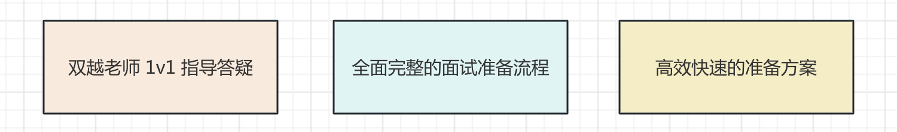
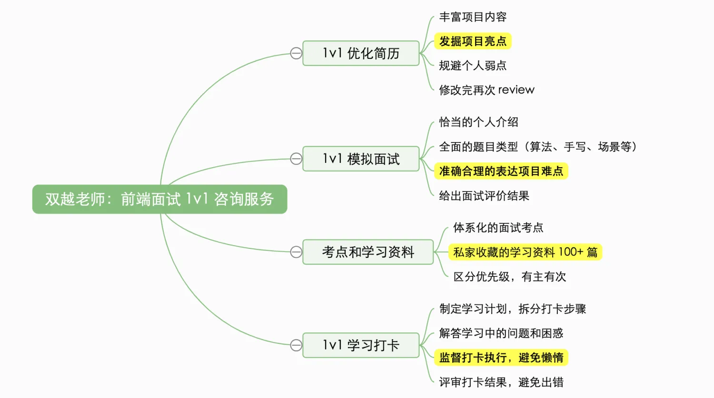

# 前端金牌简历计划

前端面试派 作者 [双越老师](https://juejin.cn/user/1714893868765373) 带领的 **1v1 前端面试咨询服务**

专业解决下面的问题：

- 初入职场不知道如何写简历，如何写出内容和亮点
- 不知道如何准备面试题，搜出很多资料，但无从下手
- 工作几年，项目都是重复性的，写不出亮点和成绩
- 工作快 10 年了，但还是一线开发人员，如何体现个人经验？
- 业余不学习，基础知识很差，面试没信心
- 工作多年只会 Vue ，不懂算法，没有技术广度和深度
- 在一个公司呆久了，不知道该如何面试了
- 刚毕业，没实际项目经验
- ......

## 作者介绍

大家好我是[双越](https://juejin.cn/user/1714893868765373)，wangEditor 作者，前百度、滴滴资深前端工程师，PMP，慕课网金牌讲师，博客总流量 500w ，代表作品：

- [wangEditor](https://www.wangeditor.com/) 开源 Web 富文本编辑器，GitHub Star 18k
- [划水AI](https://www.huashuiai.com/) Node 全栈 AIGC 知识库，AI 智能写作，多人协同编辑
- [前端面试派](https://www.mianshipai.com/) 系统专业的面试导航，大厂面试流程，开源免费

我从 2017 年开始在慕课网讲授前端面试课程，是全网第一个做前端面试课程的讲师，至今已服务学员 5w+ 看过简历 2000+ 收到很多好评。而且，我此前一直是大厂面试官，非常清楚前端面试的流程和要求。

## 缘起

2023 年 5 月开始，我推出了一个简单的 1v1 技术咨询服务，可以聊任何技术话题。陆续有很多人找我咨询，但绝大部分人都是为了优化简历，发掘亮点。

于是，我就改变了咨询方向，专门进行前端简历优化，帮助发掘个人、项目亮点。没想到效果非常好，他们给出了很好的评价，我也赚到了一些零花钱。

再后来咨询的人多了，我发现大家除了简历优化之外，还有很多其他面试相关的问题。于是我就根据个人的工作、授课、咨询的经验，制定了一个**系统全面的面试准备解决方案**。可以帮大家快速全面的准备面试。

再到 2025 年，我带领开发了 [前端面试派](https://www.mianshipai.com/) ，在这个网站的基础上，将该服务进行再一次升级为 **金牌简历计划**。

## 金牌简历计划

不仅仅是优化简历，还会帮你扩展内容补全简历，从技能到项目。

不仅仅是发掘项目亮点，还会帮你摆正项目角色，提升技术视野。

不仅仅是两次 1v1 语音沟通，还有 3 个月的全流程跟踪、专属服务。

## 服务内容

### 1v1 前端简历优化

优化简历，发掘个人亮点和项目亮点。提高面邀率，增加面试机会，减少“已读不回”。

程序员的特点就是不会表达，做的出来，但简历上写不出来 —— 本服务就是来解决这个问题。

该服务会详细的、逐行的帮你分析简历，包括：专业技能，工作经历，项目经验。

特别是项目经验，会重点分析项目的功能和业务，帮你反掘项目亮点，帮你写出最好的表达方式。

有些同学已经工作 5 年以上，甚至 7 8 年了，还在以一个基层开发者的视角来描述项目，这肯定是不行的。此时需要你以一个项目前端负责人的视角来看待项目、描述项目，要多去考虑 `设计` `架构` `方案` 等这些方面。

还有，讲师会一边咨询，一边帮你记录和整理（全程不需要你动手，你只负责认真听），最后会发修改建议给你。

待你修改完以后，讲师还会再帮你 review 一次简历，看是否还有问题。

> 我之前在 B 站分享了很多关于简历优化的[案例](https://www.bilibili.com/list/697803545/?sid=3349286&oid=113976721539637&bvid=BV1rwNReZEB1)，欢迎去参考～

### 补全专业技能

根据你现有的专业技能，你的工作经验年限，以及你未来要面试的公司规模，统一考虑，制定你需要补充的技能。

**要让你的专业技能，符合你工作经验年限，也符合目标公司的要求**。工作 2 年的和工作 8 年的，技能要求肯定不一样。小厂和大厂技能要求也不一样。

如果你想面试大厂，要补充**算法**。

如果你工作多年只会 Vue ，要恶补 **React** 技术栈，2 周即可从入门到熟练。

如果你想争取一份技术负责人的角色，你需要熟悉 **Node 服务端**，还有**前端工程化**。

如果你的项目规模比较大，需要考虑**微前端**方向。

想要争取到心仪的 offer 肯定需要进步、需要恶补，这个服务会告诉你方向，而且 [面试派](https://www.mianshipai.com/) 就有免费的内容。

学习过程中遇到问题怎么办？—— 好办，会有专属答疑服务，见下文。

### 1v1 模拟面试

如果你不确定自己准备的如何，或者表达不流畅，或者面试紧张社恐，那最好来一次模拟面试，及早暴露问题。

会模拟真实的面试场景，包括：自我介绍，基础知识面试，框架，项目介绍和成就，场景题等...

如果你刚毕业不久，会更多考察基础知识、框架和编码能力。

如果你工作时间较长，会更多考察你的项目，设计和架构能力，以及场景解答能力。

如果你要面试中大厂，会更多考察算法和原理。

最后，面试官会给你详细的面试反馈和建议。

### 全过程跟踪 & 专属答疑

两次 1v1 结束了，但我们的服务还会继续，全过程跟踪你的学习、投简历、面试、谈薪和 offer

在这个过程中，你有任何问题都可以提问，将有专门的讲师为你答疑，给你提出最合理的简历。

例如学习过程中遇到了技术问题或者 bug ，投递简历已读不回，面试没通过，谈薪时是否应该多争取一点...

该服务会持续 3 个月时间，可以从头到尾覆盖你的面试完整流程。

## 服务流程

- 报名，个人情况初步沟通（预约方式见下文）
- 第一次 1v1 语音私聊：简历优化 + 补全技能 `1.5h`
- 第二次 1v1 语音私聊：模拟面试 `1h`
- 专属答疑 `3 个月`

PS. 模拟面试可能会安排另外一位讲师，是经过双越老师筛选过的，有多年大厂和面试官经验的。

## 价格

1499 元

发微信群或朋友圈分享 [前端面试派](https://www.mianshipai.com/) 相关文章，可优惠 100 元 。

推荐其他人报名，可获得推荐费 100 元。

## 报名方式

[加群](/docs/services/group.md) 私聊群主 `双越` （或直接加 vx `fe-wfp`），报名`金牌简历计划`

报名时先交 399 元定金，锁定预约的时间，待服务开始时再交尾款。

## 注意事项

### 延期或取消

距离预约时间超过 24 小时

- 修改咨询时间，免费。
- 取消，需扣除 100 元的定金作为违约金。

距离预约时间 24 小时之内

- 修改咨询时间，需扣除 100 元的定金作为违约金。
- 取消，需扣除 200 元的定金作为违约金。

### 迟到

迟到 5 分钟之内，可不扣费。

迟到 5 - 10 分钟，需扣除 50 元定金作为违约金。

迟到 10 - 20 分钟，需扣除 100 元定金作为违约金。

迟到 20 - 30 分钟，需扣除 150 元定金作为违约金。

迟到超过 30 分钟，则视为取消本地 1v1 服务。
